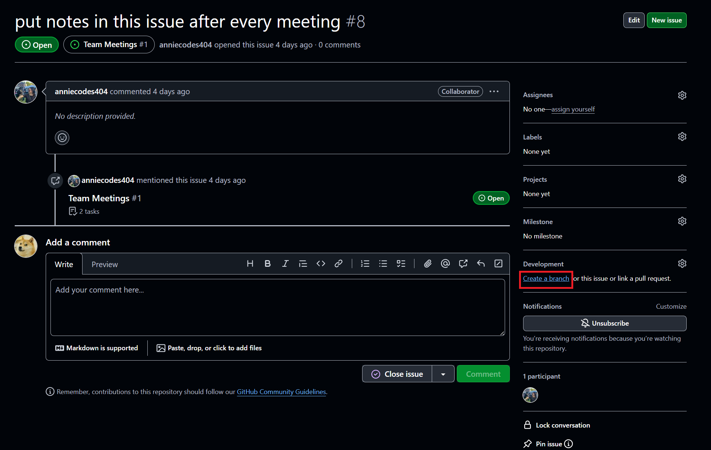
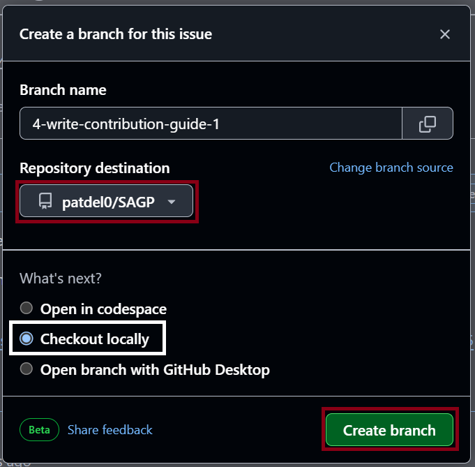
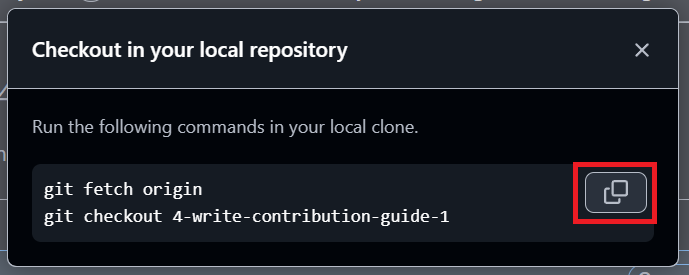

# Contribution guide 

> [!NOTE]  
> This is a project for learning! Don’t worry about making mistakes—everything here is reversible. This project is designed as a safe space to learn and experiment.

## Table of Contents
1. [Requirements](#requirements)  
2. [Installing git](#installing-git)  
3. [Fork the repository](#fork-the-repository)  
4. [Choosing an issue to work on](#choosing-an-issue-to-work-on)  
5. [Pushing changes](#pushing-changes)  
6. [Creating a Pull Request](#creating-a-pull-request)  
7. [Note on Code Review](#note-on-code-review)  
   7.1 [For reviewers](#for-reviewers)  
8. [Creating issues](#creating-issues)  

## 1. Requirements
- git

## 2. Installing git
Before cloning your forked repository to your local machine, you must have Git installed. You can find instructions for installing Git for your operating system [here](https://git-scm.com/book/en/v2/Getting-Started-Installing-Git).

Also, consider watching this tutorial if you haven't learned about git yet (Recommended by Leon but not required): https://www.youtube.com/watch?v=SWYqp7iY_Tc

## 3. Fork the repository
You can fork the repository by clicking <a href="https://github.com/patdel0/SAGP/fork">Fork</a>.  
A fork is a copy of the repository that will be placed on your GitHub account.

**Note:** It should create a URL that looks like the following -> `https://github.com/<your_GitHub_user_name>/SAGP`.  

**For example:** `https://github.com/octocat/SAGP`.

**Be Aware:** What you have created is a forked copy in a remote version on GitHub. It is not on your local machine yet.

## 4. Choosing an issue to work on
The [project board](https://github.com/users/patdel0/projects/9/views/1) contains issues you can pick from and work on. Alternatively, you can use the [Issues page](https://github.com/patdel0/SAGP/issues) for a more streamlined user interface.  

You can pick one that you think is suitable for you. If you are working for the first time on an Open Source project, you’ll find the ["good first issue"](https://github.com/patdel0/SAGP/issues?q=is%3Aissue+is%3Aopen+label%3A%22good+first+issue%22) labelled issues to be best suited for you.  

You can reply under the issue thread for help, clarification or provide updates on your progress.

## 5. Pushing changes

Once you've chosen an issue and are ready to work on it, head over to the "Development" section and click "Create branch".  

Ensure you select your fork in the "Repository destination", "Checkout locally" and click the green button "Create branch".  

Copy the git commands GitHub is suggesting and enter them in your terminal.  

## 6. Creating a Pull Request
Prior to merging your code into the project, your code will need to be reviewed by one of our contributors. A Pull Request template is provided.  
Ensure the placeholder or explanatory text is removed and that the issue you're addressing is referenced successfully. This ensures it will be automagically closed when the changes are merged into main.

- [More information on linking a pull request to an issue](https://docs.github.com/en/issues/tracking-your-work-with-issues/using-issues/linking-a-pull-request-to-an-issue)

## 7. Note on Code Review
Code review is an opportunity for developers to share their knowledge and improve their skills.  
As a reviewer, you can learn from the code being reviewed, and as the reviewee, you can benefit from the feedback you receive.

If your PR needs some adjustments, don't take it personally and use it as a chance to learn.  
It is an opportunity to discuss techniques for optimising and improving our craft, so don't hesitate to geek out (as long as you don't unnecessarily block the PR).

### 7.1 For reviewers
- **Be kind:** Focus on the code, not the person. Everyone’s here to learn, and reviews should feel helpful, not discouraging.
- **Give clear suggestions:** If something needs to change, explain why and how. The goal is to make things better together.
- **Watch for issues:** Test the changes if you can, and check for anything that might break or behave differently than expected.
- **Highlight the good stuff:** If you spot something done well, say so! Encouragement goes a long way.
- **Ask questions:** If something isn’t clear, don’t assume—it’s okay to ask why something was done a certain way. It opens the door for a good discussion and helps everyone improve.

## 8. Creating issues
If you spot something that needs attention or have an idea for an improvement, feel free to open a new issue. Simply navigate to the [Issues page](https://github.com/patdel0/SAGP/issues) and click on "New Issue."

Provide a concise description of the problem or suggestion, and include relevant context like expected behaviour or steps to reproduce any issues.

Consider going through [GitHub's article](https://docs.github.com/en/issues/tracking-your-work-with-issues/configuring-issues/quickstart) on the subject for additional information.

